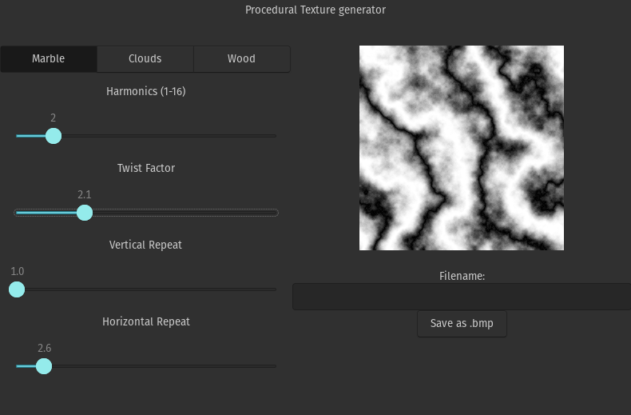

## WIP: procedural texture generator
Simple texture generator using _value noise_.

Technology stack: _C_, _GTK_, _GLADE_

## How to run?
- On Linux:
  1. `cmake .`
  2. `make`
  3. `./procedural-texture-generator`

### Conventions
- _Pattern_ is an array of values in type double in range 0..1. It helps with representing image pixel data in black and white.
- _Texture_ is an array of values in type RGB.
  - RGB is structure of unsigned chars { red, blue, green }
  
### Features Todo:
- [x] Turbulence
- [x] Clouds
- [x] Marble
- [x] Wood
- [x] GTK

### Optional Todo:
- [ ] 3D Noise
    - [ ] .gif compatibility

### Refactor Todo: 
- [ ] make indexer for RGB/HSL type
- [x] make modular noises
- [x] put handlers in separate directory
- [x] separate ui logic
